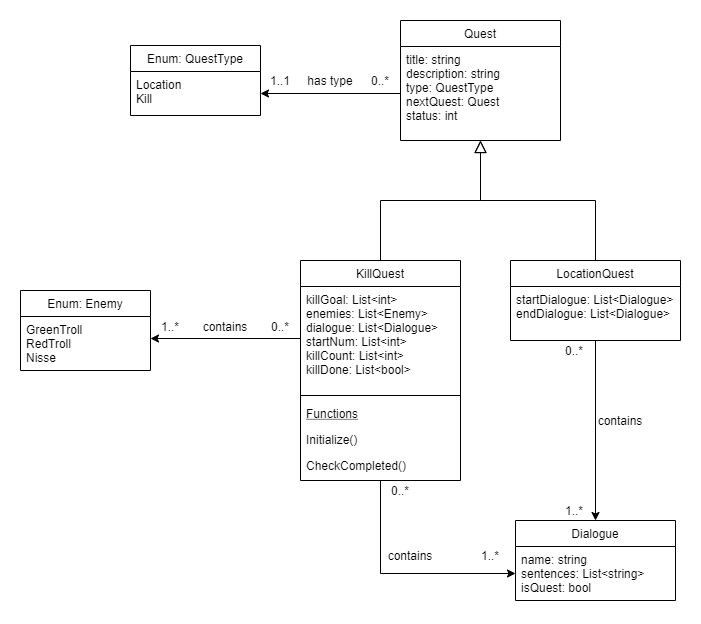

# Good code
The code I have developed and is most satisfied with, is the dialogue system. One aspect I had in mind when developing it was that I wanted it to be modular and applicable for several use cases. This turned out to be hard, especially at the start of the project. This was the very first feature I developed, which means I had limited knowledge during the first iteration of the dialogue system. However, I ended up making both small and big improvements one the system during the project lifetime

Firstly, I want to explain the different ways the dialogue system is used in game. Each instance of a dialogue is stored in a scriptable object, which is shown in the image above. Common for all dialogues is that the title is static, and the sentences are typed out letter by letter. The user needs to click through the sentences. The different use cases are currently as follows:
-	Dialogue box:
o	Displays a text box at the bottom of the screen.
o	An example is quest dialogue.
-	Info screen:
o	Takes up the whole screen to display information.
o	An example of usage is player death.

At first, I struggled with separating responsibility into different classes. I put all functionality into two files: one for managing the dialogue and one for triggering it. This quickly became messy, and made it harder to implement additional features. I decided to do a whole rework of the system. The new version split responsibility into even more files:
-	One file to handle user interaction.
-	One file to change and write out the sentences of the dialogue.
-	One file to trigger dialogue when the player steps into an area.

Pictured above is an excerpt from the interaction class. This handles both manual and automatic start of the dialogue. Manual start means that the player needs to be inside a certain area where they can see the text “Press E to interact”, and press the key to activate the dialogue. The opposite of this is the automatic start. When this is enabled, the dialogue is started right after activation.
Of course, I do not think all of the code related to the dialogue system is good. However, I think this is the most refined feature I created during the project. The part I like the most about it is the fact that it can be used in various ways. I also do not think it will be too hard to expand if more use cases show up later.

# Bad code
I want to discuss two parts I developed that I think ended up bad. The main reason they ended up bad is because I did not get the chance to start developing the quest system until the very end. Other aspects of the game were deemed more important, and the whole quest system was therefore given a low priority.

First, I need to explain how the quest system is put together. Shown above is an UML diagram I have created to illustrate it. There are currently two types of quests: kill quests and location quests. Kill quests are quests that asks the player to kill a certain amount of some enemies. Location quests asks the player to go to a certain area. Each quest contains dialogue for all states of the quest: not started, in progress and completed. To link multiple quests together, each quest contains a reference to the quest that should be started after its completion (if there is one).

A script containing a class called QuestTrigger is used to change the state and dialogue of a quest when the player walks to a certain area. 

## Tutorial
The first part I want to discuss is the tutorial. The tutorial consists of two classes, TutorialManager and TutorialFragment. The TutorialManager’s job is to control the flow of the tutorial. The TutorialManager consists of multiple TutorialFragments. These are the tasks the player needs to complete to finish the tutorial. They are stored in a queue, and each one consists of a mark to signal which type of task it is, and a dialogue. 

If I were to improve this feature, I would have utilized the quests system. Having all quest/task related functionality being handled by the same system would improve both the readability and the modularity of the code. As seen in the image above, the update loop of the TutorialManager is a combination of actually checking if the tasks have been completed and managing the flow of the tutorial. If I had the time, I would have turned the tasks into quests, and by doing this sent the task responsibility over to the quest manager.

I also think this would be possible because of the type of quests that are currently available. There are three tasks in the tutorial: pick up a weapon, kill an enemy, and go through a portal. All of these tasks can be integrated with the quest system, as there are quest types for both killing and location. Picking up a weapon and going through the portal can be put into the location category, while killing an enemy can be put in the kill category.

## Quest and dialogue
The second part I would like to discuss it the relationship between the dialogue system and the quest system. The thing that made this part tricky to develop, is the fact that each quest has dialogue for each state of the quest. In addition, when a quest is completed, a new one is sometimes supposed to start.

In my current solution the quest is progressed even though the dialogue that belongs to the state has not been read yet. For example, the quest is started as soon as the player enters the quest trigger area. For the player to display the dialogue connected to the quest, they need to first press a button. As a result of this the player only needs to enter the area to start and finish quests, which is not optimal at all.  A way this could be solved is by adding checks that says whether or not the dialogue has been read. This can then be used as a condition for the quest to start.

The dialogue is also being reassigned each time the player enters the trigger. This is not ideal as the dialogue to be displayed at a given moment does not change that often. I would fix this by adding a check to see if the state of the quest has changed, and only change the dialogue if it has.

# Learning outcome
At the start of the course, I found myself quite overwhelmed. It was hard creating new features with limited knowledge. I looked at existing solutions, and they often had parts that was not necessary for our game. I learnt that it is wise to start small, and expand when needed. However, this was a bit challenging as I needed to make sure the small part was modular enough to easily expand upon later on. What I found helped me when things seemed too “big”, was drawing a draft of how the different components should interact with each other. I also created UML diagrams when I was more sure of how the feature should be built.

When it comes to the game engine used, I feel learning Unity was a great experience. There is a lot of good documentation, and I found most things in the editor to be intuitive. Because of this, I could focus more on the (code) design and coding.

Working in groups remotely also worked out great. I think one of the reasons it worked out as well as it did, is because of the way we utilized the version control system. The Kanban board that contained all project tasks made it easy to allocate and estimate issues. There were never any uncertainties around what should be worked on. We also had a set meeting each week where the features worked on in the last week would be showed and reviewed. For my part, this acted as motivation to complete my tasks within the deadline. 

The main impressions I am left with at the end of the project is that things are usually more complex and take more time than you think. However, I had a lot of fun, and definitely want to try game development again.
